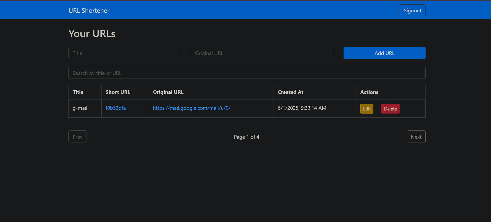
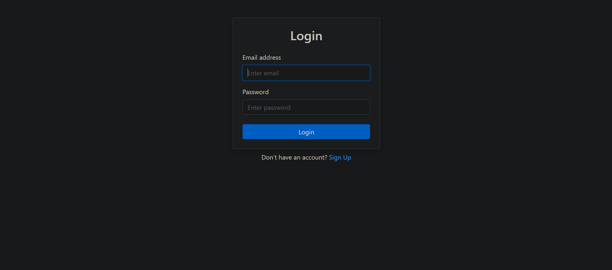

# 🔗 URL Shortener App

A full-stack web application to shorten URLs with user authentication.

## 🧰 Tech Stack
- **Frontend**: React, Axios
- **Backend**: Spring Boot, JWT, MySQL
- **Database**: MySQL
- **Authentication**: JWT-based login/register

## 🔑 Features
- User signup/login/logout
- Create up to 5 short URLs per user
- Edit/delete short URLs
- Pagination and search on dashboard
- Redirect to original URL via `/u/{code}`

## 📦 Project Structure

```
URL_Shortener_App/
├── url-shorten-app-frontend/
└── url-shortening-app-backend/
```

## 📸 Screenshots

### 🏠 Homepage


### 🔐 Login


